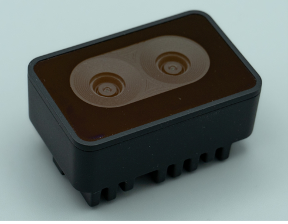
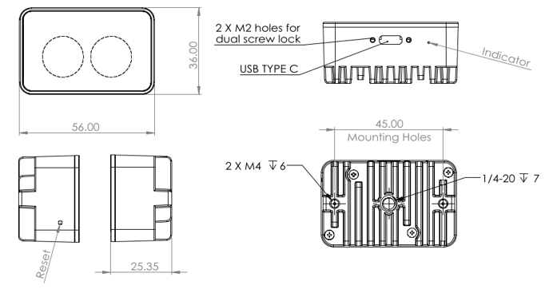
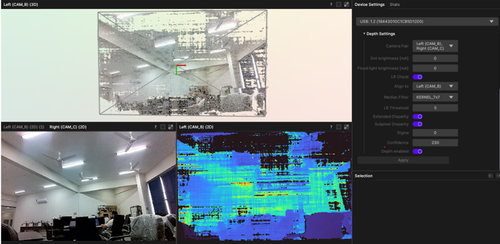

# OAK-D-SR-Camera-depthAi

OAK-D SR camera, a cutting-edge solution revolutionizing spatial perception and depth sensing. Designed to empower machines with human-like understanding of their environment, the OAK-D SR camera combines the power of stereo vision and artificial intelligence for unparalleled depth perception. With its advanced capabilities, it enables precise 3D mapping, object detection, and tracking, making it an ideal choice for applications in robotics, autonomous vehicles, augmented reality, and more. Whether navigating complex environments or interacting with the world around it, the OAK-D SR camera sets a new standard for spatial awareness and intelligence. For more information: https://docs.luxonis.com/projects/hardware/en/latest/pages/OAK-D-SR/

<div style="display: flex; justify-content: center;">
  
  
</div>


### Specifications
Here are some key specifications of the OAK-D SR camera:

- Stereo Vision: The OAK-D SR camera utilizes a stereo vision system, consisting of two synchronized cameras, to accurately capture depth information. This allows it to perceive the world in three dimensions, similar to how human vision works.
- Depth Sensing: With its stereo vision setup, the OAK-D SR camera can generate dense depth maps, providing precise distance measurements to objects in its field of view. This depth sensing capability is crucial for obstacle avoidance, scene reconstruction, and object recognition tasks.
- AI Processing: Equipped with onboard AI processing capabilities, the OAK-D SR camera can perform real-time analysis of the captured data. This enables tasks such as object detection, classification, and tracking directly on the device, without relying on external computing resources.
- High Resolution: The OAK-D SR camera boasts high-resolution imaging capabilities, capturing detailed visual information from its surroundings. This ensures clarity and accuracy in depth perception, enhancing the overall performance of applications that rely on spatial awareness.
- Low Latency: Designed for real-time applications, the OAK-D SR camera features low latency processing, minimizing delays between data capture and analysis. This rapid response time is crucial for time-sensitive tasks, such as autonomous navigation and interactive systems.
- Open-Source Platform: Built on an open-source platform, the OAK-D SR camera provides developers with access to its hardware specifications, software libraries, and development tools. This fosters innovation and collaboration within the developer community, enabling the creation of diverse applications and solutions.
- Modular Design: The OAK-D SR camera is designed with a modular architecture, allowing for flexibility and customization to suit specific application requirements. Its compact form factor makes it easy to integrate into various devices and systems, without compromising performance or functionality.

Overall, the OAK-D SR camera offers a powerful combination of stereo vision, AI processing, and versatility, making it a valuable tool for a wide range of spatial perception and depth-sensing applications.

## DepthAi
DepthAI is the advanced depth sensing and AI processing platform that empowers devices with human-like perception and intelligence. Developed by Luxonis, DepthAI combines cutting-edge depth sensing technology with onboard artificial intelligence to enable real-time spatial awareness, object detection, and depth mapping. With its compact form factor and customizable architecture, DepthAI offers developers a powerful solution for creating immersive augmented reality experiences, autonomous navigation systems, smart cameras, and more. Whether it's enhancing human-machine interaction or enabling autonomous decision-making, DepthAI sets a new standard for depth perception and AI processing in embedded systems. For more information: https://docs.luxonis.com/en/latest/

<div align="center">
  
</div>

See official documentation and github profile for details and code explanations
https://github.com/luxonis/depthai

```
git clone --recursive https://github.com/luxonis/depthai.git
```
